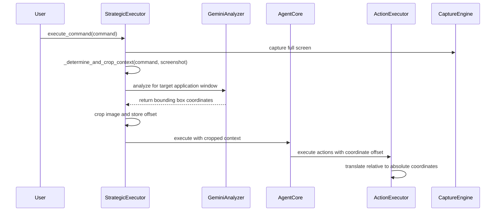

# Design Document

## Overview

The Focused Context Execution feature implements an intelligent pre-flight analysis system that identifies the primary application window for a given task and crops the visual context to that window's boundaries. This optimization reduces API costs, improves processing speed, and increases accuracy by eliminating visual distractions from irrelevant screen elements.

The design leverages the existing hierarchical architecture where the `StrategicExecutor` acts as the high-level strategist and the `AgentCore` serves as the tactical executor. The focused context is determined at the strategic level and transparently provided to the tactical level.

## Architecture

### High-Level Flow



### Component Interactions

1. **StrategicExecutor Enhancement**: Acts as the context manager, determining the optimal visual scope for task execution
2. **GeminiAnalyzer Integration**: Provides fast application window detection using vision models
3. **AgentCore Transparency**: Operates normally regardless of whether context is cropped or full-screen
4. **ActionExecutor Coordination**: Handles coordinate translation from relative (cropped) to absolute (screen) positions

## Components and Interfaces

### StrategicExecutor Enhancements

#### New Method: `_determine_and_crop_context`
```python
def _determine_and_crop_context(self, command: str, full_screenshot: np.ndarray) -> Dict[str, Any]:
    """
    Analyzes the command and screenshot to determine if focused context should be used.
    
    Args:
        command: User's natural language command
        full_screenshot: Full screen capture as numpy array
        
    Returns:
        Dictionary containing:
        - use_focused_context: bool
        - cropped_image: np.ndarray (if focused)
        - coordinate_offset: Tuple[int, int] (x, y offset from screen origin)
        - bounding_box: Dict with x, y, width, height
    """
```

#### Enhanced Context Dictionary
The context passed to `AgentCore` will include:
- `focused_context_image`: Cropped image (if applicable)
- `coordinate_offset`: (x, y) offset for coordinate translation
- `focused_region_config`: Region configuration for the cropped area

### GeminiAnalyzer Integration

#### New Application Detection Prompt
A specialized prompt template for fast application window identification:
```python
APPLICATION_DETECTION_PROMPT = """
Analyze the screenshot and identify the primary application window that would be most relevant for this command: "{command}"

Look for:
1. The main application window that the user likely wants to interact with
2. Active/focused windows vs background windows
3. Dialog boxes or modal windows that might be part of the target application

Respond with a JSON object containing the bounding box of the target application window:
{{
  "found_target_application": true/false,
  "application_name": "detected application name",
  "bounding_box": {{
    "x": left_coordinate,
    "y": top_coordinate, 
    "width": window_width,
    "height": window_height
  }},
  "confidence": 0.0-1.0
}}

If no clear target application can be identified, set found_target_application to false.
"""
```

### ActionExecutor Enhancements

#### Coordinate Translation Logic
```python
def _apply_coordinate_offset(self, relative_coords: Tuple[int, int], context: Dict[str, Any]) -> Tuple[int, int]:
    """
    Translates relative coordinates (from cropped context) to absolute screen coordinates.
    
    Args:
        relative_coords: (x, y) coordinates relative to cropped image
        context: Context dictionary containing coordinate_offset
        
    Returns:
        Absolute screen coordinates
    """
    offset = context.get("coordinate_offset", (0, 0))
    return (relative_coords[0] + offset[0], relative_coords[1] + offset[1])
```

## Data Models

### FocusedContextResult
```python
@dataclass
class FocusedContextResult:
    use_focused_context: bool
    cropped_image: Optional[np.ndarray] = None
    coordinate_offset: Tuple[int, int] = (0, 0)
    bounding_box: Optional[Dict[str, int]] = None
    application_name: Optional[str] = None
    confidence: float = 0.0
```

### Enhanced Context Dictionary
```python
context = {
    # Existing fields
    "rule_name": str,
    "variables": Dict[str, Any],
    "region_configs": Dict[str, Any],
    
    # New focused context fields
    "use_focused_context": bool,
    "coordinate_offset": Tuple[int, int],
    "focused_region_config": Optional[Dict[str, Any]],
    "original_screen_dimensions": Tuple[int, int]
}
```

## Error Handling

### Fallback Strategy
- If application detection fails or returns low confidence, fall back to full-screen execution
- If cropping fails due to invalid coordinates, use full-screen context
- If coordinate translation fails, log error and use original coordinates

### Validation Logic
```python
def _validate_bounding_box(self, bbox: Dict[str, int], screen_width: int, screen_height: int) -> bool:
    """Validates that bounding box is within screen boundaries and has positive dimensions."""
    x, y, w, h = bbox.get("x", 0), bbox.get("y", 0), bbox.get("width", 0), bbox.get("height", 0)
    
    return (
        x >= 0 and y >= 0 and w > 0 and h > 0 and
        x + w <= screen_width and y + h <= screen_height and
        w >= 100 and h >= 100  # Minimum reasonable window size
    )
```

### Error Recovery
- **Detection Failure**: Continue with full-screen context
- **Cropping Failure**: Log warning and use full-screen context  
- **Coordinate Translation Failure**: Use original coordinates with warning
- **Invalid Bounding Box**: Validate dimensions and screen boundaries before cropping

## Testing Strategy

### Unit Tests
- `test_determine_and_crop_context()`: Test application detection logic
- `test_coordinate_translation()`: Verify coordinate offset calculations
- `test_bounding_box_validation()`: Test edge cases for window boundaries
- `test_fallback_behavior()`: Ensure graceful degradation when detection fails

### Integration Tests
- End-to-end task execution with focused context
- Multi-monitor setup compatibility
- Performance comparison between focused and full-screen modes
- Accuracy testing with various application types

### Performance Benchmarks
- API cost reduction measurement
- Processing time improvement quantification
- Memory usage optimization verification

### Test Scenarios
1. **Single Application Focus**: Command targeting specific app (e.g., "Save this document")
2. **Dialog Box Handling**: Commands when modal dialogs are present
3. **Multi-Window Applications**: Apps with multiple windows open
4. **Ambiguous Context**: Commands that could apply to multiple applications
5. **Full-Screen Fallback**: Scenarios where focused context isn't beneficial