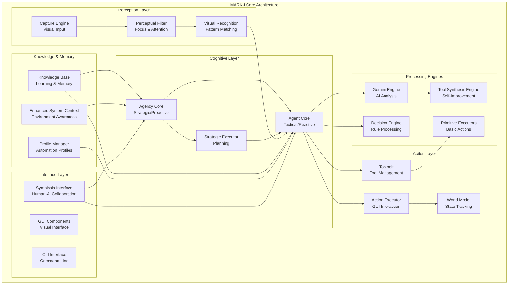
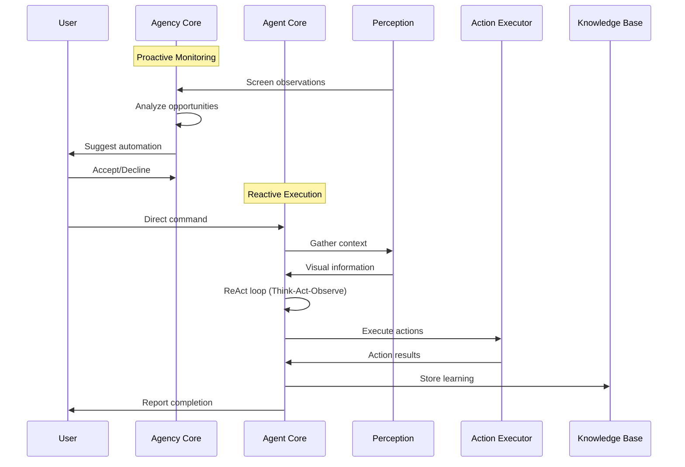

# MARK-I Core Architecture Design Document

## Overview

MARK-I implements a sophisticated hierarchical AI architecture that combines strategic reasoning, tactical execution, and specialized processing engines. The system operates as a symbiotic intelligence platform that can proactively assist users, learn from experiences, and continuously expand its capabilities through self-improvement mechanisms.

The architecture follows the Eye-Brain-Hand paradigm where:
- **Eye (Perception)**: Multi-modal environmental sensing and visual processing
- **Brain (Cognition)**: Hierarchical AI cores with strategic and tactical reasoning
- **Hand (Action)**: Precise execution and interaction capabilities

## Architecture

### Core Components Hierarchy



### Data Flow Architecture



## Components and Interfaces

### 1. Agency Core (Strategic/Proactive)

**Purpose**: High-level strategic reasoning and proactive opportunity detection

**Key Interfaces**:
```python
class AgencyCore:
    def monitor_environment(self) -> List[Opportunity]
    def evaluate_opportunity(self, opportunity: Opportunity) -> OpportunityAssessment
    def suggest_automation(self, assessment: OpportunityAssessment) -> AutomationSuggestion
    def learn_from_interaction(self, interaction: UserInteraction) -> None
    def update_strategic_knowledge(self, knowledge: StrategyKnowledge) -> None
```

**Responsibilities**:
- Passive screen monitoring and pattern recognition
- Opportunity identification and assessment
- Strategic planning and goal decomposition
- User preference learning and adaptation
- Proactive suggestion generation

### 2. Agent Core (Tactical/Reactive)

**Purpose**: Direct command execution using ReAct cognitive loops

**Key Interfaces**:
```python
class AgentCore:
    def execute_command(self, command: str) -> ExecutionResult
    def react_loop(self, goal: Goal) -> ReActResult
    def think(self, context: Context) -> Thought
    def act(self, action: Action) -> ActionResult
    def observe(self, result: ActionResult) -> Observation
    def handle_uncertainty(self, uncertainty: Uncertainty) -> Resolution
```

**Responsibilities**:
- Direct command interpretation and execution
- ReAct loop implementation (Reason-Act-Observe)
- Tool selection and coordination
- Error handling and recovery
- Context-aware decision making

### 3. Tool Synthesis Engine

**Purpose**: Self-improvement through dynamic tool creation

**Key Interfaces**:
```python
class ToolSynthesisEngine:
    def identify_capability_gap(self, problem: Problem) -> CapabilityGap
    def design_tool_specification(self, gap: CapabilityGap) -> ToolSpec
    def generate_tool_code(self, spec: ToolSpec) -> ToolImplementation
    def validate_tool_safety(self, tool: ToolImplementation) -> SafetyAssessment
    def integrate_tool(self, tool: ToolImplementation) -> IntegrationResult
```

**Responsibilities**:
- Capability gap analysis
- Tool specification design
- Code generation and implementation
- Security validation and sandboxing
- Dynamic tool integration

### 4. Perceptual Filter (Intelligent Focus)

**Purpose**: Attention management and distraction filtering

**Key Interfaces**:
```python
class PerceptualFilter:
    def identify_focus_targets(self, context: Context) -> List[FocusTarget]
    def apply_attention_filter(self, image: Image, targets: List[FocusTarget]) -> FilteredImage
    def learn_ignore_patterns(self, patterns: List[IgnorePattern]) -> None
    def adapt_focus_strategy(self, feedback: FocusFeedback) -> None
    def optimize_processing_efficiency(self) -> EfficiencyMetrics
```

**Responsibilities**:
- Application window identification and focus
- Visual noise filtering and attention management
- Distraction pattern learning
- Processing optimization
- Context-aware focus adaptation

### 5. Knowledge Base (Learning & Memory)

**Purpose**: Persistent learning and experience storage

**Key Interfaces**:
```python
class KnowledgeBase:
    def store_experience(self, experience: Experience) -> None
    def retrieve_similar_experiences(self, context: Context) -> List[Experience]
    def update_application_knowledge(self, app_info: ApplicationInfo) -> None
    def learn_user_preferences(self, preferences: UserPreferences) -> None
    def organize_knowledge_graph(self) -> KnowledgeGraph
```

**Responsibilities**:
- Experience storage and retrieval
- Application interface learning
- User preference tracking
- Knowledge organization and indexing
- Pattern recognition and generalization

## Data Models

### Core Data Structures

```python
@dataclass
class Opportunity:
    context: Context
    trigger_event: Event
    confidence_score: float
    suggested_actions: List[Action]
    user_benefit: str

@dataclass
class ReActStep:
    thought: str
    action: Action
    observation: str
    confidence: float
    timestamp: datetime

@dataclass
class CapabilityGap:
    problem_description: str
    missing_capabilities: List[str]
    success_criteria: List[str]
    priority: Priority
    complexity_estimate: int

@dataclass
class FocusTarget:
    application: str
    window_bounds: Rectangle
    relevance_score: float
    attention_weight: float
    ignore_patterns: List[Pattern]

@dataclass
class Experience:
    context: Context
    actions_taken: List[Action]
    outcome: Outcome
    success_metrics: Dict[str, float]
    lessons_learned: List[str]
```

### Configuration Models

```python
@dataclass
class EthicalGuidelines:
    risk_assessment_rules: List[Rule]
    prohibited_actions: List[str]
    safety_thresholds: Dict[str, float]
    user_consent_requirements: List[str]

@dataclass
class SymbiosisSettings:
    collaboration_style: CollaborationStyle
    communication_preferences: CommunicationPrefs
    trust_level: float
    autonomy_boundaries: AutonomyBoundaries
```

## Error Handling

### Self-Correction Mechanism

```python
class SelfCorrectionEngine:
    def detect_failure(self, execution_result: ExecutionResult) -> FailureAnalysis
    def analyze_failure_cause(self, failure: FailureAnalysis) -> CauseAnalysis
    def generate_alternative_strategies(self, cause: CauseAnalysis) -> List[Strategy]
    def test_strategy_viability(self, strategy: Strategy) -> ViabilityScore
    def implement_correction(self, strategy: Strategy) -> CorrectionResult
    def update_strategy_knowledge(self, correction: CorrectionResult) -> None
```

### Error Recovery Patterns

1. **Graceful Degradation**: When advanced features fail, fall back to simpler approaches
2. **Retry with Adaptation**: Modify strategy parameters and retry failed operations
3. **User Collaboration**: Engage user for clarification when autonomous recovery fails
4. **Learning Integration**: Convert failures into learning opportunities
5. **Context Switching**: Change focus or approach when current context is problematic

## Testing Strategy

### Multi-Level Testing Approach

1. **Unit Testing**
   - Individual component functionality
   - Tool synthesis validation
   - Perceptual filter accuracy
   - Knowledge base operations

2. **Integration Testing**
   - Core component interactions
   - ReAct loop execution
   - Self-correction mechanisms
   - Focus and attention systems

3. **Behavioral Testing**
   - Proactive suggestion accuracy
   - Learning and adaptation effectiveness
   - Ethical reasoning validation
   - Symbiotic collaboration quality

4. **Performance Testing**
   - Processing efficiency with focus
   - Memory usage optimization
   - Response time benchmarks
   - Scalability under load

5. **Safety Testing**
   - Tool synthesis security validation
   - Ethical boundary enforcement
   - User privacy protection
   - System stability under edge cases

### Testing Infrastructure

```python
class TestingFramework:
    def create_simulation_environment(self) -> SimulationEnv
    def generate_test_scenarios(self, complexity: int) -> List[TestScenario]
    def measure_learning_effectiveness(self, before: State, after: State) -> LearningMetrics
    def validate_ethical_compliance(self, actions: List[Action]) -> ComplianceReport
    def benchmark_performance(self, workload: Workload) -> PerformanceMetrics
```

## Security Considerations

### Tool Synthesis Security

- **Code Sandboxing**: All synthesized tools run in isolated environments
- **Capability Restrictions**: Limit tool access to specific system resources
- **Validation Pipeline**: Multi-stage security analysis before tool integration
- **Audit Trail**: Complete logging of tool creation and usage
- **User Approval**: Require explicit consent for powerful tool synthesis

### Privacy Protection

- **Data Minimization**: Store only necessary information for functionality
- **Encryption**: Secure storage of sensitive user data and preferences
- **Access Controls**: Role-based access to different system capabilities
- **Anonymization**: Remove personally identifiable information from learning data
- **User Control**: Granular privacy settings and data deletion options

### Ethical Safeguards

- **Risk Assessment**: Evaluate potential harm of all proposed actions
- **Consent Mechanisms**: Clear user approval for sensitive operations
- **Transparency**: Explain reasoning behind decisions and suggestions
- **Accountability**: Maintain logs for audit and review purposes
- **Override Capabilities**: Allow users to override system decisions