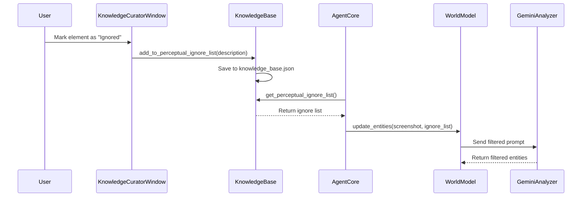

# Design Document

## Overview

The Perceptual Filtering feature implements a user-trainable system that allows Mark-I to ignore specified visual elements during screen analysis. This system addresses the problem of "visual noise" from persistent but irrelevant screen elements that can clutter the AI's reasoning and create opportunities for distraction and error.

The design integrates seamlessly with the existing KnowledgeBase and WorldModel architecture, adding filtering capabilities at the perception layer while maintaining backward compatibility with all existing functionality.

## Architecture

### High-Level Flow



### Component Integration

1. **KnowledgeBase Enhancement**: Manages persistent storage of perceptual filters
2. **WorldModel Integration**: Applies filtering during entity analysis
3. **Knowledge Curator GUI**: Provides user interface for managing ignore list
4. **AgentCore Coordination**: Orchestrates filtering during task execution

## Components and Interfaces

### KnowledgeBase Enhancements

The KnowledgeBase already includes the basic structure for perceptual filtering in v18.0. We need to add methods for managing the ignore list:

#### New Methods
```python
def remove_from_perceptual_ignore_list(self, item_description: str) -> bool:
    """Removes an item description from the perceptual ignore list."""

def get_perceptual_ignore_list_formatted(self) -> str:
    """Returns the ignore list formatted for inclusion in AI prompts."""

def clear_perceptual_ignore_list() -> bool:
    """Clears all items from the perceptual ignore list."""
```

#### Enhanced JSON Schema
```json
{
  "aliases": {},
  "perceptual_filters": {
    "ignore_list": [
      "desktop clock widget in top-right corner",
      "floating video player window",
      "system notification popup",
      "taskbar weather widget"
    ]
  },
  "user_data": {},
  "objectives": []
}
```

### WorldModel Integration

The WorldModel needs to be enhanced to accept and use ignore list filtering during entity analysis.

#### Enhanced Entity Update Method
```python
def update_entities(self, screenshot: np.ndarray, ignore_list: List[str] = None) -> List[Dict[str, Any]]:
    """
    Updates the current understanding of UI entities, applying perceptual filtering.
    
    Args:
        screenshot: Current screen capture
        ignore_list: List of element descriptions to ignore during analysis
        
    Returns:
        Filtered list of detected entities
    """
```

#### Filtering Prompt Template
```python
ENTITY_ANALYSIS_PROMPT_WITH_FILTERING = """
Analyze the provided screenshot and identify all interactive UI elements, buttons, text fields, and other interface components.

IMPORTANT: Ignore any elements that match these descriptions:
{ignore_list_formatted}

For each relevant element you find, provide:
1. Element type (button, text_field, label, etc.)
2. Descriptive text or label
3. Approximate bounding box coordinates
4. Current state (enabled/disabled, focused/unfocused, etc.)

Do not include any elements that match the ignore list descriptions above.

Respond with a JSON array of detected elements.
"""
```

### Knowledge Curator Window Enhancements

The existing KnowledgeCuratorWindow needs new functionality to support adding items to the ignore list.

#### New UI Components
```python
# Add to the button frame
self.btn_ignore = ctk.CTkButton(
    button_frame, 
    text="Add to Ignore List", 
    command=self.ignore_candidate,
    fg_color="orange"
)

def ignore_candidate(self):
    """Adds the current candidate to the perceptual ignore list."""
    candidate = self.original_candidates[self.current_candidate_index]
    description = candidate.get("description", "")
    
    if description:
        # Add to knowledge base ignore list
        success = self.knowledge_base.add_to_perceptual_ignore_list(description)
        if success:
            messagebox.showinfo("Added to Ignore List", 
                              f"'{description}' will now be ignored during analysis.")
            self.next_candidate()
```

#### Ignore List Management Window
```python
class IgnoreListManagerWindow(ctk.CTkToplevel):
    """
    A dedicated window for viewing and managing the perceptual ignore list.
    """
    
    def __init__(self, master, knowledge_base: KnowledgeBase):
        # Implementation for viewing, editing, and deleting ignore list items
```

### AgentCore Integration

The AgentCore needs minimal changes to pass the ignore list to the WorldModel during entity analysis.

#### Enhanced Entity Analysis
```python
def _update_world_model_entities(self, screenshot: np.ndarray):
    """Updates the world model with current screen entities, applying perceptual filtering."""
    ignore_list = self.knowledge_base.get_perceptual_ignore_list()
    entities = self.world_model.update_entities(screenshot, ignore_list)
    return entities
```

## Data Models

### PerceptualFilter
```python
@dataclass
class PerceptualFilter:
    description: str
    added_date: str
    usage_count: int = 0
    last_matched: Optional[str] = None
```

### Enhanced KnowledgeBase Schema
```python
{
  "perceptual_filters": {
    "ignore_list": List[str],
    "filter_metadata": {
      "total_filters_added": int,
      "last_updated": str,
      "version": str
    }
  }
}
```

### FilteredEntityResult
```python
@dataclass
class FilteredEntityResult:
    entities: List[Dict[str, Any]]
    filtered_count: int
    ignore_matches: List[str]
    processing_time: float
```

## Error Handling

### Ignore List Validation
```python
def _validate_ignore_description(self, description: str) -> bool:
    """Validates that an ignore description is suitable for filtering."""
    if not description or len(description.strip()) < 3:
        return False
    if len(description) > 200:  # Reasonable limit
        return False
    return True
```

### Filtering Robustness
- **Empty Ignore List**: System operates normally without filtering
- **Invalid Descriptions**: Skip invalid entries and log warnings
- **Filtering Failures**: Fall back to unfiltered analysis if filtering fails
- **Performance Issues**: Implement timeout for filtering operations

### Error Recovery Strategies
1. **Malformed Ignore List**: Validate and clean entries on load
2. **Filtering Timeout**: Use unfiltered results if filtering takes too long
3. **Storage Failures**: Cache ignore list in memory if file operations fail
4. **GUI Errors**: Provide fallback text-based ignore list management

## Testing Strategy

### Unit Tests
- `test_perceptual_ignore_list_management()`: Test CRUD operations for ignore list
- `test_entity_filtering_logic()`: Verify entities are properly filtered
- `test_ignore_list_persistence()`: Ensure ignore list survives application restarts
- `test_filtering_performance()`: Measure impact on analysis speed

### Integration Tests
- End-to-end filtering workflow from GUI to entity analysis
- Knowledge base persistence across application sessions
- Compatibility with existing entity detection systems
- Multi-user ignore list scenarios

### User Experience Tests
- Ignore list management through Knowledge Curator interface
- Visual feedback when elements are filtered
- Performance impact on task execution speed
- Accuracy improvement measurement

### Edge Case Testing
1. **Large Ignore Lists**: Test with 50+ ignored elements
2. **Ambiguous Descriptions**: Test filtering with vague descriptions
3. **Dynamic Content**: Test with changing screen elements
4. **Multi-Monitor Setups**: Ensure filtering works across displays
5. **High-Frequency Updates**: Test rapid ignore list modifications