# MARK-I Architecture Diagram

This document contains the comprehensive component diagram for MARK-I's hierarchical AI architecture.

## System Overview

MARK-I operates as a hierarchical, multi-core AI system with distinct layers of cognition, from sensory perception to strategic reasoning to tactical execution.

## Component Architecture

```mermaid
graph TB
    %% User Interface Layer
    subgraph "User Interface Layer"
        GUI[MainAppWindow<br/>CustomTkinter GUI]
        CLI[CLI Interface]
        AppController[AppController<br/>Orchestrates UI & Cores]
    end

    %% Perception Layer (The Senses)
    subgraph "Perception Layer - The Senses"
        PE[PerceptionEngine<br/>Multi-modal Sensing]
        CE[CaptureEngine<br/>Screen Capture]
        AE[ActionExecutor<br/>Input Simulation]
        
        PE --> CE
        PE --> OSHooks[OS Event Hooks<br/>pywinauto]
        PE --> AudioInput[Audio Input<br/>Voice Commands]
    end

    %% Agency Layer (The Will/Executive Brain)
    subgraph "Agency Layer - The Will"
        AC[AgencyCore<br/>Proactive Strategic AI]
        CD[Core Directives<br/>AI Purpose & Goals]
        SE[StrategicExecutor<br/>High-level Planning]
        
        AC --> CD
        AC --> SE
    end

    %% Agent Layer (The Cognitive/Tactical Core)
    subgraph "Agent Layer - The Cognitive Core"
        AgentCore[AgentCore<br/>ReAct Tactical Executor]
        WM[WorldModel<br/>Entity-Graph Representation]
        TB[Toolbelt<br/>Dynamic Tool Collection]
        
        AgentCore --> WM
        AgentCore --> TB
        
        subgraph "Tools"
            SystemTools[System Tools<br/>Hotkeys, Clicks, Text]
            CognitiveTools[Cognitive Tools<br/>Reasoning, Analysis]
            BCITools[BCI Tools<br/>Brain-Computer Interface]
            CustomTools[Custom Tools<br/>Dynamically Created]
        end
        
        TB --> SystemTools
        TB --> CognitiveTools
        TB --> BCITools
        TB --> CustomTools
    end

    %% Knowledge & Memory Layer
    subgraph "Knowledge & Memory Layer"
        KB[KnowledgeBase<br/>Long-term Memory]
        KDE[KnowledgeDiscoveryEngine<br/>Proactive Learning]
        IgnoreList[Perceptual Filter<br/>Visual Noise Filtering]
        
        KB --> IgnoreList
        KB --> KDE
    end

    %% AI Processing Layer
    subgraph "AI Processing Layer"
        GA[GeminiAnalyzer<br/>LLM Interface]
        Models[Gemini Models<br/>Pro/Flash/Lite]
        
        GA --> Models
    end

    %% Foresight & Simulation Layer
    subgraph "Foresight Layer"
        SimEngine[SimulationEngine<br/>Predictive Modeling]
        BCIEngine[BCIEngine<br/>Brain-Computer Interface]
        SCW[SharedCognitiveWorkspace<br/>Human-AI Collaboration]
        
        SimEngine --> SCW
        BCIEngine --> SCW
    end

    %% Core Infrastructure
    subgraph "Core Infrastructure"
        Config[AppConfig<br/>Environment & Models]
        Logging[Logging System<br/>Structured Logs]
        EnvValidator[Environment Validator<br/>Config Validation]
        
        Config --> EnvValidator
    end

    %% Data Flow Connections
    GUI --> AppController
    CLI --> AppController
    AppController --> AC
    AppController --> AgentCore
    AppController --> PE

    %% Perception Flow
    PE --> AC
    CE --> AgentCore
    AE --> AgentCore

    %% Agency Flow
    AC --> AgentCore
    SE --> AgentCore

    %% Knowledge Flow
    AgentCore --> KB
    AC --> KB
    KB --> AgentCore
    KB --> AC

    %% AI Processing Flow
    AgentCore --> GA
    AC --> GA
    WM --> GA

    %% Foresight Flow
    AgentCore --> SimEngine
    AC --> BCIEngine
    SimEngine --> AgentCore

    %% Infrastructure Flow
    Config --> GA
    Config --> PE
    Config --> AC
    Config --> AgentCore

    %% User Interaction Flow
    AppController -.-> User[User]
    AC -.-> User
    AgentCore -.-> User

    %% External Systems
    AgentCore --> ExternalApps[External Applications<br/>VSCode, Browser, etc.]
    AE --> ExternalApps

    %% Styling
    classDef perception fill:#e1f5fe
    classDef agency fill:#f3e5f5
    classDef agent fill:#e8f5e8
    classDef knowledge fill:#fff3e0
    classDef ai fill:#fce4ec
    classDef foresight fill:#f1f8e9
    classDef infrastructure fill:#f5f5f5
    classDef ui fill:#e3f2fd

    class PE,CE,AE,OSHooks,AudioInput perception
    class AC,CD,SE agency
    class AgentCore,WM,TB,SystemTools,CognitiveTools,BCITools,CustomTools agent
    class KB,KDE,IgnoreList knowledge
    class GA,Models ai
    class SimEngine,BCIEngine,SCW foresight
    class Config,Logging,EnvValidator infrastructure
    class GUI,CLI,AppController ui
```

## Data Flow Description

### 1. Proactive Cognitive Loop
1. **PerceptionEngine** continuously monitors screen, audio, and OS events
2. **AgencyCore** analyzes perception data against Core Directives
3. **AgencyCore** generates strategic goals and presents them to user
4. Upon confirmation, **AgentCore** executes tactical steps using ReAct pattern
5. **WorldModel** maintains entity-graph representation of environment
6. **KnowledgeBase** stores learned patterns and user preferences

### 2. Interactive Command Flow
1. User enters command via **GUI** or **CLI**
2. **AppController** routes command to **AgentCore**
3. **AgentCore** uses **Toolbelt** to execute actions
4. **CaptureEngine** provides visual feedback
5. **ActionExecutor** performs system interactions

### 3. Learning & Adaptation
1. **KnowledgeDiscoveryEngine** identifies patterns in user behavior
2. **KnowledgeBase** stores strategies and success rates
3. **Perceptual Filter** learns to ignore visual noise
4. **Tool Synthesis** creates new capabilities dynamically

### 4. AI Processing Pipeline
1. Visual/textual data flows to **GeminiAnalyzer**
2. **GeminiAnalyzer** uses appropriate model (Pro/Flash/Lite) based on task
3. Results feed back to **AgentCore** and **AgencyCore** for decision making

## Key Architectural Principles

- **Hierarchical Cognition**: Agency (Strategic) → Agent (Tactical) → Tools (Execution)
- **Separation of Concerns**: Each layer has distinct responsibilities
- **Dependency Inversion**: High-level modules don't depend on low-level details
- **Extensibility**: Dynamic tool creation and knowledge expansion
- **User Safety**: Confirmation loops for autonomous actions
- **Continuous Learning**: Feedback loops improve performance over time